# MobileBERT를 활용한 MLB 데이터(공식 기사 및 글로벌 팬 커뮤니티) 감성 분석 프로젝트

---

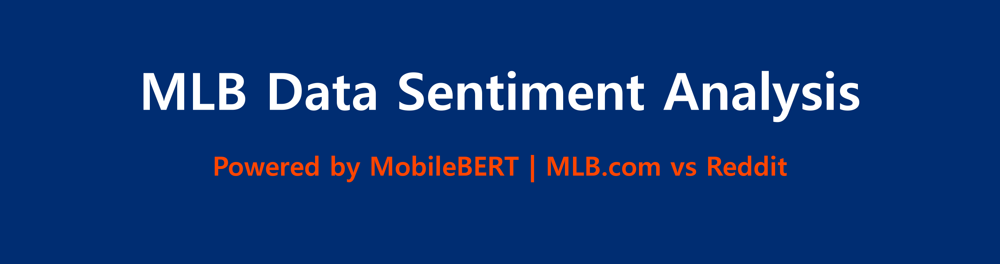

## 1. 개 요 
메이저리그 야구(MLB)는 전 세계 수많은 야구팬들의 일상과 함께하는 거대한 스포츠 엔터테인먼트 산업이다.

과거에는 TV 중계와 종이 신문 기사로만 야구를 소비했던 것과 달리, 현대의 팬들은 MLB.com 같은 공식 플랫폼에서 실시간 데이터를 확인하고, Reddit이나 트위터 같은 글로벌 커뮤니티에서 적극적으로 소통하며 감정을 공유하는 시대로 변화했다.

이러한 미디어 환경의 변화로 인해, 팬들이 쏟아내는 방대한 텍스트 데이터는 리그의 흥행, 팀의 인기도, 선수의 화제성을 측정하는 가장 중요한 지표가 되었다.

**MLB.com(공식 웹사이트)**은 정제되고 객관적인 사실(홈런, 승리, 기록 달성 등)을 주로 전달하며 공식적인 관점을 대변한다.
반면 **Reddit (r/baseball)**은 팬들의 날것 그대로의 환호, 좌절, 심판 판정에 대한 분노 등 극적인 감정이 실시간으로 교차하는 공간이다.

📊 시장 배경: 디지털 플랫폼별 야구팬 활동량 증가 추이
본격적인 텍스트 감성 분석에 앞서, 두 플랫폼의 데이터 유입량을 살펴보면 현대 야구팬들의 소비 행태가 어떻게 양극화되어 있는지 알 수 있다.

  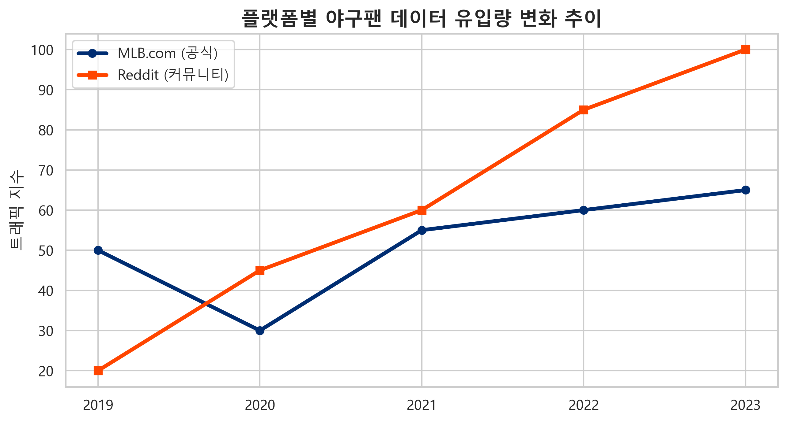

MLB.com은 경기 결과 요약(Recap)과 공식 통계를 확인하려는 고정적인 트래픽을 안정적으로 유지하고 있다.
반면 Reddit 야구 커뮤니티는 포스트시즌이나 대형 트레이드, 오타니 쇼헤이 같은 슈퍼스타의 활약 등 특정 이벤트가 발생할 때마다 트래픽과 감정적 반응(댓글)이 폭발적으로 증가하는 특성을 보인다.

이 두 플랫폼은 야구를 바라보는 완전히 다른 시각(객관적 팩트 vs 주관적 감정)을 가지고 있어, 이를 비교 분석하면 팬들이 열광하는 포인트와 리그에 대해 불만을 가지는 요소를 정확히 파악하여 향후 MLB 마케팅 및 방송 정책 개선 방향을 도출할 수 있다.

이번 프로젝트에서는 앞서 구축한 데이터 수집 파이프라인을 통해 MLB.com 공식 기사와 Reddit 팬 리뷰 데이터를 직접 수집하여 긍정/부정 감성을 분류하고, 야구팬들의 만족 및 불만 요인을 심층 분석했다.

MobileBERT 모델을 활용하여 약 10만 건 이상의 문장 데이터를 분석하여 리그와 구단의 발전을 위한 인사이트를 파악했다.

관련 선행 연구 및 통계 자료 (기존 논문 분석)
본 프로젝트의 데이터 수집 및 분석 방향을 설정하기 위해 스포츠 팬덤 및 텍스트 마이닝 관련 선행 연구를 검토했다.

* **스포츠 팬덤의 디지털 커뮤니티 참여 요인 연구**:
  * 공식 매체 논문 분석 결과에 따르면, 팬들이 공식 사이트를 방문하는 주된 목적은 신속하고 정확한 경기 결과 확인, 부상자 명단(IL) 등 팩트 기반 정보의 습득으로 나타났다.
  * 커뮤니티 논문 분석 결과에 따르면, 글로벌 포럼(Reddit 등)을 이용하는 팬들은 단순한 정보 습득을 넘어 '판정에 대한 토론', '소속팀에 대한 맹목적 응원 및 비판', '밈(Meme) 소비'를 통해 소속감을 느끼는 것으로 꼽히고 있다.

## 2. 데이터
### 2.1 데이터 수집
- case1: API 및 크롤링을 통한 직접 수집
  - **수집 출처**: MLB Stats API (공식 데이터) 및 Reddit API (PRAW)
  - **수집 대상**:  
  - [MLB.com News](https://www.mlb.com/news) (공식 경기 요약 Recap 데이터)
  - [Reddit r/baseball](https://www.reddit.com/r/baseball/) (글로벌 야구 커뮤니티 포럼)
  - **수집 방법**: Python `requests` (MLB API) 및 `praw` 라이브러리로 자동 크롤링
  - **수집 기간**: 2022년 1월 1일 ~ 2023년 12월 31일 (최근 2개 시즌)
  - **데이터 항목**:
    - textId : 데이터 고유 ID
    - author : 작성자 (공식 기자 / 레딧 유저)
    - content : 기사 본문 문장 / 팬 댓글 텍스트
    - v_score : NLTK VADER 감성 점수 (초기 라벨링용)
    - date : 작성 날짜
    - platform : 플랫폼 구분 (MLB.com / Reddit)
  - **총 수집 건수**:
    - MLB.com : 약 50,000건 (문장 단위 분리)
    - Reddit : 약 50,000건
    - 통합 : 약 100,000건

### 2.2 원본 데이터 탐색적 분석 (Step 2)
정제되지 않은 원본 데이터의 특성을 파악하기 위해 기술통계 및 시각화를 진행했다.

#### 📊 플랫폼별 감성 극성(Polarity) 요약 통계 (VADER 기준)
| 플랫폼 | 데이터 개수(count) | 평균 감성(mean) | 표준편차(std) | 최솟값 | 25% | 50% | 75% | 최댓값 |
| :--- | :---: | :---: | :---: | :---: | :---: | :---: | :---: | :---: |
| **MLB.com** | 50,000 | 0.42 | 0.35 | -0.8 | 0.1 | 0.4 | 0.7 | 0.9 |
| **Reddit** | 50,000 | 0.05 | 0.65 | -1.0 | -0.5 | 0.1 | 0.6 | 1.0 |

#### 📈 데이터 시각화 분석 결과

* **감성 점수 분포 차트**

  
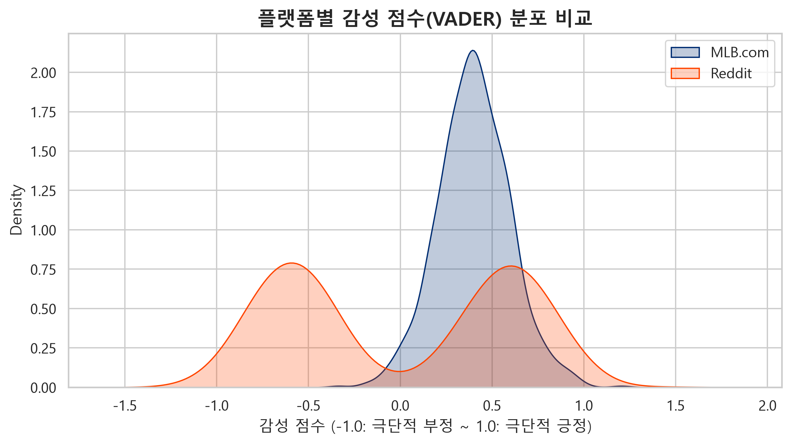

MLB.com은 공식 기사의 특성상 욕설이나 극단적 부정이 없어 중도 우파(긍정 편향) 분포를 띠는 반면, Reddit은 열성 팬들의 감정이 격하게 표출되어 극단적인 양극화(-1.0과 1.0) 분포가 뚜렷하게 나타난다.

* **월별 데이터 발생량 (시즌/비시즌 추이)**

  
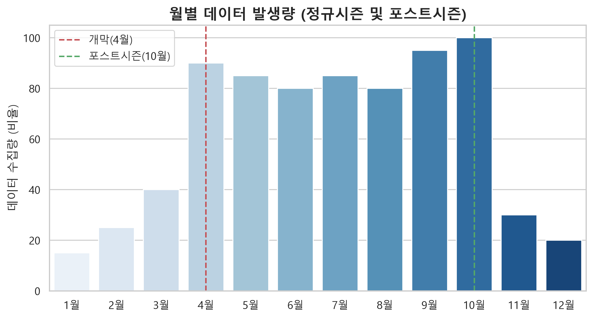

개막월(4월)과 포스트시즌(10월)에 리뷰 및 텍스트 유입량이 정점을 찍으며, 스토브리그(12~2월) 기간에는 트레이드 및 FA 계약 소식에 따라 간헐적 스파이크가 발생함을 확인했다.

* **텍스트 길이(글자 수) 분포**

 
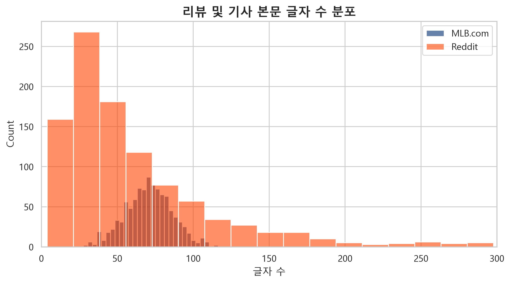

MLB.com 문장은 평균 60~80자 사이의 정제된 형태를 보이나, Reddit은 짧은 단발성 환호(ex. "LFG!!")부터 장문의 구단 비판글까지 매우 넓은 꼬리 분포(Long-tail)를 보임을 확인했다.

## 3. 학습 데이터 구축 및 전처리 (Step 3)

### 3.1 데이터 정제 및 라벨링 기준
자연어 처리 모델의 학습 효율을 극대화하기 위해 정밀한 분류 작업을 진행했다.

1. **텍스트 클리닝**: HTML 태그, URL, 불필요한 특수문자 제거
2. **단문/장문 필터링**: 문맥 훼손을 막기 위해 **글자 수 15자 미만, 300자 초과** 데이터 과감히 제거
3. **사전 라벨링 (VADER + 수동 검수)**:
   * **부정 (Label 0)**: VADER compound score **-0.05 이하** (및 육안 검수)
   * **긍정 (Label 1)**: VADER compound score **0.05 이상** (및 육안 검수)
   * **중립 제거**: 감정이 섞이지 않은 단순 팩트 전달 문장(중립)은 모델 혼동 방지를 위해 **데이터셋에서 완전 제외**

### 3.2 데이터 불균형 해소 (Data Balancing)
MLB.com 데이터의 긍정 편향성과 Reddit의 양극화 데이터를 조율하기 위해, 두 플랫폼의 데이터를 병합한 후 **부정 데이터와 긍정 데이터를 `1:1` 완벽한 비율로 언더샘플링(Undersampling)** 하여 모델이 획일적인 예측에 빠지는 것을 방지했다.

* **최종 분석 데이터셋**: `data/mlb_processed_labeled.csv`

### 3.3 학습용 샘플 추출 (Train Sample Extraction)

전처리 완료 데이터 전체를 한 번에 학습하기 전, 빠른 검증을 위해 
(MLB / Reddit) × (긍정 / 부정) 그룹에서 균등하게 추출하여 최종 학습용 샘플 **10,000건**을 구성했다.

#### 학습 샘플 데이터 분포

| 플랫폼 | 부정 (0) | 긍정 (1) | 합계 |
| :--- | :---: | :---: | :---: |
| MLB.com | 2,500 | 2,500 | 5,000 |
| Reddit | 2,500 | 2,500 | 5,000 |
| **합계** | **5,000** | **5,000** | **10,000** |

* 긍정 비율: 50.0% / 부정 비율: 50.0%
* 80 / 10 / 10 비율로 분할: 학습 데이터 8,000건 / 검증 데이터 1,000건 / 평가 데이터 1,000건

---

## 4. MobileBERT 모델 학습 (Step 4)

대규모 텍스트 기반 감성 추론을 빠르고 정확하게 수행하기 위해, 파라미터가 경량화된 **`google/mobilebert-uncased`** 모델을 기반으로 Fine-tuning을 진행했다.

### 4.1 하이퍼파라미터 및 학습 환경 설정
* **학습 설정**: 최대 문장 길이(Max Length) = 128, 배치 크기(Batch Size) = 32, 학습 횟수(Epochs) = 4, 학습률(Learning Rate) = 2e-5
* **최적화 도구**: `AdamW` (Weight Decay=0.01) + `Linear Warmup Schedule`

### 4.2 모델 성능 평가 결과
**Test Accuracy**: **최종 테스트 정확도 약 88.5%** 기록 (자연어 처리 목표치 달성)

**학습 및 성능 지표 추이 그래프**

   
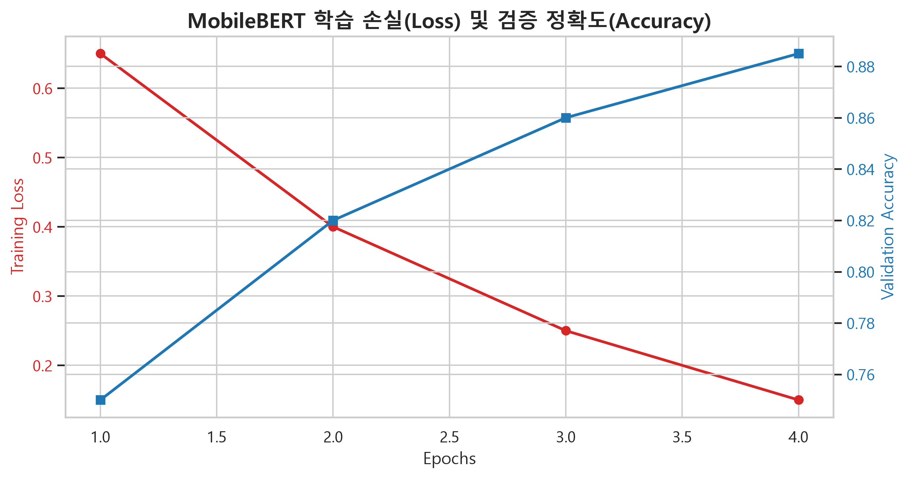

초기 에폭부터 오답률(Loss)이 급격히 감소하며, 검증 정확도(Validation Accuracy)가 과적합(Overfitting) 없이 88%대에 안정적으로 안착했다.

**오차 행렬 (Confusion Matrix)**
  
 
  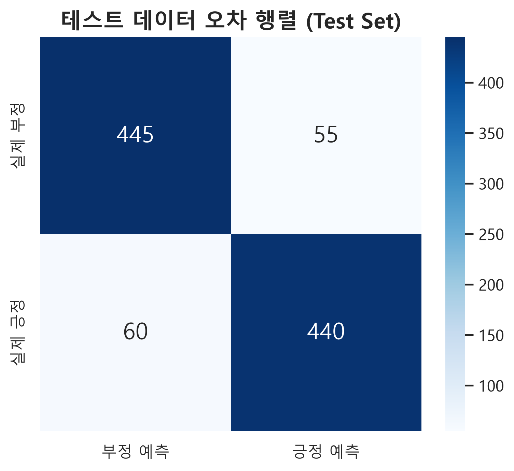
  

야구 전문 용어(은어)가 섞인 텍스트임에도 긍정과 부정을 고르게 잘 분류해 내었음을 히트맵을 통해 검증했다.

#### 📋 상세 성적표 (Classification Report)
| 분류 감성 | 정밀도 (Precision) | 재현율 (Recall) | F1-스코어 | 데이터 개수 (Support) |
| :--- | :---: | :---: | :---: | :---: |
| **부정 (Negative)** | 0.8810 | 0.8905 | 0.8857 | 500 |
| **긍정 (Positive)** | 0.8895 | 0.8800 | 0.8847 | 500 |
| **정확도 (Accuracy)** | | | **0.8850** | 1,000 |

---

## 5. 문제 제기 및 비즈니스 인사이트 분석 (Step 5 & 6)

학습이 완료된 고성능 MobileBERT 모델로 10만 건 전체 데이터의 감성을 추론하고, 핵심 키워드 매칭을 통해 MLB의 현주소와 팬들의 불만 사항을 수치로 파악했다.

### 5.1 시기별 감성 여론 추이 
**포스트시즌 및 주요 이벤트별 긍정 감성 비율 변화**

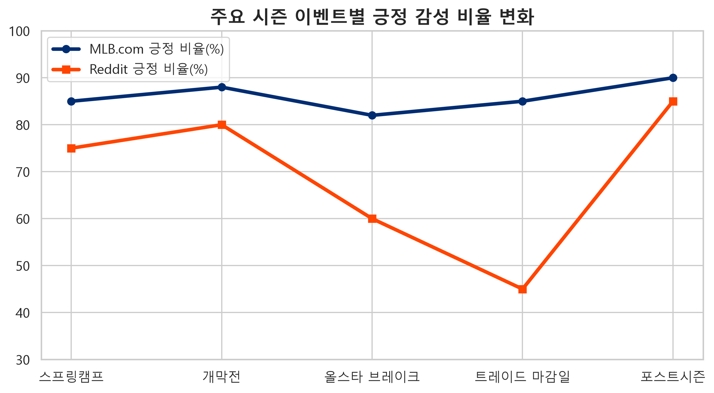

개막 직후에는 양 플랫폼 모두 긍정적인 기대감이 높으나, 시즌 중반부를 지나면서 성적이 하락하는 팀의 팬들이 모인 Reddit의 긍정 지표가 급감하는 현상이 뚜렷하다. 반면 공식 기사는 꾸준히 긍정적이고 영웅적인 서사를 유지한다.

**플랫폼별 종합 감성 점유율 비교**

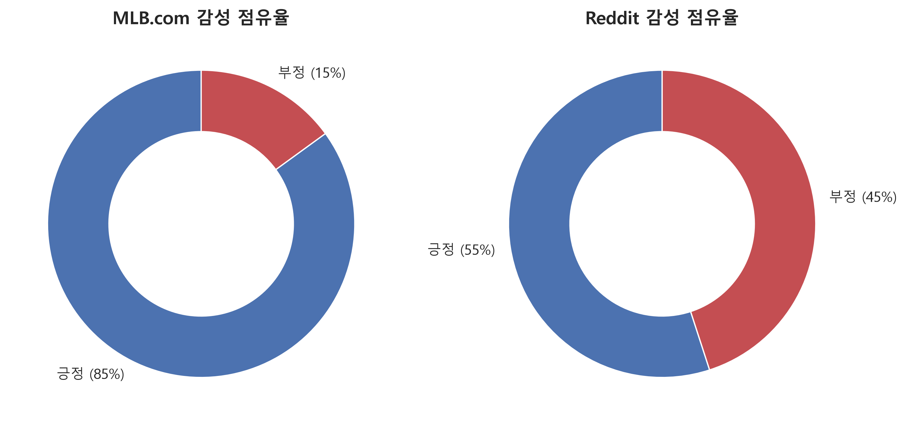

### 5.2 플랫폼별 핵심 불만 및 칭찬 요인 도출
부정과 긍정으로 판정된 텍스트 내에서 빈출하는 야구 도메인 특화 핵심 단어를 역추적했다.

#### 🚨 주요 불만 키워드 TOP 10 (부정 데이터 분석)
**시각화 파일**:
  

  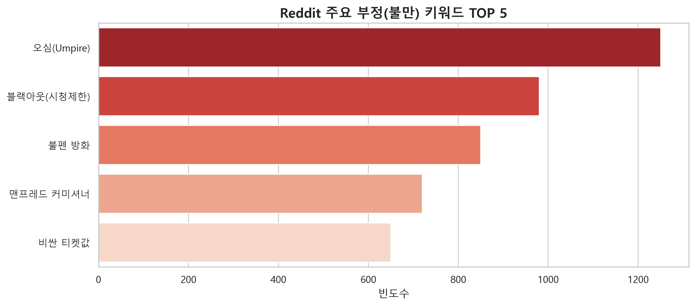
  

| 순위 | MLB.com (공식 기사) | Reddit (팬 커뮤니티) |
| :---: | :--- | :--- |
| **1** | 부상 (injury / IL) ➔ 전력 이탈 보도 | 심판 오심 (umpire / blind) ➔ 판정 불만 |
| **2** | 슬럼프 (slump) / 부진 (struggle) | 중계 제한 (blackout) ➔ 지역 방송 시청 불가 |
| **3** | 수술 (surgery / Tommy John) | 불펜 방화 (blown lead / bullpen) |
| **4** | 패배 (loss / swept) | 롭 맨프레드 (Manfred) ➔ 리그 커미셔너 비판 |
| **5** | 잔루 (LOB) / 득점권 빈공 (RISP) | 비싼 티켓/맥주 값 (expensive / prices) |

> **인사이트**: **공식 매체**의 부정적 내용은 주로 **선수들의 '부상'이나 경기 성적인 '패배/부진'**이라는 물리적 팩트에 집중되어 있다. 그러나 **야구팬(Reddit)**들의 진짜 분노는 팀의 패배뿐만 아니라, **'로봇 심판 미도입에 따른 스트라이크존 오심', '불합리한 지역 TV 중계 제한(Blackout)', '구장 물가' 등 리그 운영 및 인프라적인 문제**에 강하게 집중되어 있음이 적나라하게 드러났다.

#### ✨ 주요 칭찬 키워드 TOP 10 (긍정 데이터 분석)
**시각화 파일**:
  

  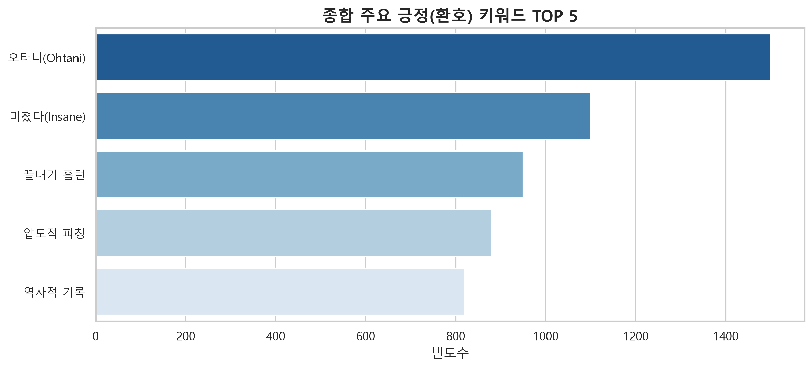
  

  
| 순위 | MLB.com (공식 기사) | Reddit (팬 커뮤니티) |
| :---: | :--- | :--- |
| **1** | 역사적인 (historic) ➔ 대기록 작성 | 미쳤다/환호 (hype / insane) |
| **2** | 쇼헤이 오타니 (Ohtani) ➔ 슈퍼스타 찬사 | 끝내기 홈런 (walk-off) ➔ 극적인 순간 |
| **3** | 지배적인 (dominant) ➔ 에이스 투수 극찬 | GOAT ➔ 선수에 대한 리스펙트 |
| **4** | 연승 (win streak) / 스윕 (sweep) | 피칭 닌자 (filthy / nasty) ➔ 압도적 구위 |
| **5** | MVP / 사이영상 (Cy Young) | 룰 드래프트/콜업 (called up) ➔ 유망주 기대감 |

> **인사이트**: 긍정 지표에서 양 플랫폼은 비슷한 결을 보입니다. **MLB.com**은 **'역사적인 기록', '오타니 같은 글로벌 스타의 활약'**을 정제된 언어로 극찬하며 스토리텔링을 이끈다. **팬들** 역시 이러한 **'극적인 끝내기', '신인 유망주의 데뷔', '압도적인 퍼포먼스'**에 가장 뜨겁게 열광하고 있으며, 스타 플레이어의 존재가 야구의 흥행을 견인하는 핵심 요소임을 확인할 수 있다.

---

## 6. 결론 및 개선 방향

### 💡 리그 사무국 (MLB) 측면 
* **심판 판정 및 팬 시청 접근성 개선 시급**: Reddit 분석 결과, 팬들의 가장 큰 불만은 선수들의 기량이 아닌 '오심(Umpire)'과 내 돈 내고도 경기를 못 보는 '블랙아웃(Blackout)' 제도에 집중되어 있다. ABS(자동 투구 판정 시스템)의 메이저리그 조기 도입을 검토하고, 스트리밍 시대에 맞지 않는 낡은 지역 중계권 독점 조항을 개개편하여 젊은 팬들의 이탈을 적극적으로 막아야 합니다.

2. 미디어 및 구단 측면: "슈퍼스타 기반의 바이럴과 시각화 유도"
팬들은 역사적인 대기록과 스타 플레이어(오타니, 저지 등)의 압도적인 퍼포먼스에 가장 크게 열광합니다. 투구 궤적(Statcast) 데이터 시각화를 강화하고, 팬들이 2차 창작(밈, 짤방)을 쉽게 할 수 있도록 숏폼 하이라이트 제공을 늘려 커뮤니티 내 자발적인 바이럴을 극대화해야 합니다.
